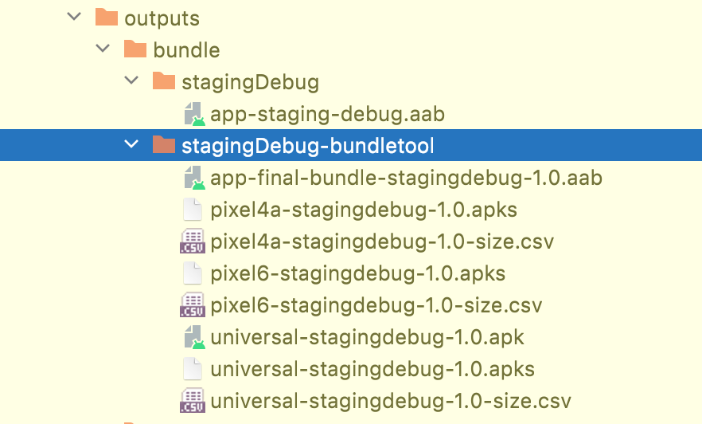

[](https://search.maven.org/artifact/me.2bab/bundle-tool-plugin)
[](https://github.com/2bab/bundle-tool-gradle-plugin/actions)
[](https://www.apache.org/licenses/LICENSE-2.0)

A Gradle Plugin for Android BundleTool, powered by [New Variant/Artifact API](https://developer.android.com/studio/build/extend-agp) & [Polyfill](https://github.com/2BAB/Polyfill). It supports:

1. Generate **".apks"** artifacts by `build-apks` command.
2. Install **".apks"** artifacts by `install-apks` command.
3. Calculate **".apks"** size by `get-size total` command and export to **".csv"** files.
4. When running `build-apks` command in Universal build mode, it also extracts universal **".apk"** artifact.
5. The plugin features can be enabled/disabled for per variant respectively.

## Usage

**0x01. Add the plugin to classpath:**

``` kotlin
buildscript {
    repositories {
        ...
        mavenCentral()
    }
    dependencies {
        classpath("com.android.tools.build:gradle:7.1.2")
        classpath("me.2bab:bundle-tool-plugin:1.2.0")
    }
}
```

**0x02. Apply Plugin:**

``` kotlin
// For your application module
plugins {
    id("me.2bab.bundletool")
}
```

**0x03. Advanced Configurations**

``` kotlin
import me.xx2bab.bundletool.*

// Run `./gradlew TransformApksFromBundleForStagingDebug` for testing all features.
bundleTool {
    // The plugin can be enabled by variant, for instance,
    // BundleToolFeature.GET_SIZE feature is disabled for "productionDebug" buildTypes,
    // BundleToolFeature.INSTALL_APKS feature is enabled for "debug" buildTypes only,
    // while other combinations are supported/enabled.
    enableByVariant { variant, feature ->
        when(feature) {
            BundleToolFeature.GET_SIZE -> {
                !(variant.buildType == "debug" && variant.flavorName == "production")
            }
            BundleToolFeature.INSTALL_APKS -> {
                variant.buildType == "debug"
            }
            else -> true
        }
    }

    // Each of them will create a work action with `build-apks` command.
    buildApks {
        create("universal") {
            buildMode.set(ApkBuildMode.UNIVERSAL.name)
        }
        create("pixel4a") {
            deviceSpec.set(file("./pixel4a.json"))
            // `deviceId` will be used for INSTALL_APKS feature only,
            // set the `deviceId` to indicate that you want to install the apks after built.
            deviceId.set(pixel4aId)
        }
        create("pixel6") {
            deviceSpec.set(file("./pixel6.json"))
        }
    }
    
    // Each of them will create a work action for above "buildApks" list items' output.
    getSize {
        create("all") {
            dimensions.addAll(
                GetSizeDimension.SDK.name,
                GetSizeDimension.ABI.name,
                GetSizeDimension.SCREEN_DENSITY.name,
                GetSizeDimension.LANGUAGE.name
            )
        }
    }
}
```

**0x04. Build your App and Enjoy!**

```shell
# Please check "enableByVariant" config to ensure you are running the one
# that enabled features you want already.
./gradlew TransformApksFromBundleForStagingDebug
```


**0x05. Extend the build flow. (Optional)**

If you would like to do something after bundletool's execution, "to upload all those products" for example. This plugin provides the output directory `Provider` for other developers to use, check the sample below:

```kotlin
// Run `./gradlew UploadApksForStagingDebug` for testing.
androidComponents {
    // Pls use the same rule as `enableByVariant{...}` over
    onVariants(selector().withBuildType("debug")) { variant ->
        tasks.register<UploadTask>("UploadApksFor${variant.name.capitalize()}") {
            // You must apply the "me.2bab.bundletool" in the build script
            // or in your plugin before calling `variant.getBundleToApksOutputDir()`.  
            this.outputDirProperty.set(variant.getBundleToApksOutputDir())
        }
    }
}

abstract class UploadTask : DefaultTask() {

    @get:org.gradle.api.tasks.InputDirectory
    abstract val outputDirProperty: DirectoryProperty

    @org.gradle.api.tasks.TaskAction
    fun upload() {
        outputDirProperty.get().asFile.listFiles().forEach { artifact ->
            logger.lifecycle("Uploading bundle-tool outputs: ${artifact.absolutePath}")
            // upload(artifact)
        }
    }
}
```

## Compatible

bundle-tool-gradle-plugin is only supported & tested on LATEST 2 Minor versions of Android Gradle Plugin.

| AGP   | BundleTool | bundle-tool-gradle-plugin |
|-------|------------|---------------------------|
| 7.1.x | 1.8.0      | 1.2.0                     |
| 7.0.x | 1.6.0      | 1.1.0                     |

## Git Commit Check

Check this [link](https://medium.com/walmartlabs/check-out-these-5-git-tips-before-your-next-commit-c1c7a5ae34d1) to make sure everyone will make a **meaningful** commit message.

So far we haven't added any hook tool, but follow a regex rule like below:

```
(chore|feature|clean|upgrade|docs|fix|refactor|style|test|hack|release)(:)( )(.{0,80})
```

## License

>
> Copyright 2016-2022 2BAB
>
>Licensed under the Apache License, Version 2.0 (the "License");
you may not use this file except in compliance with the License.
You may obtain a copy of the License at
>
>   http://www.apache.org/licenses/LICENSE-2.0
>
> Unless required by applicable law or agreed to in writing, software
distributed under the License is distributed on an "AS IS" BASIS,
WITHOUT WARRANTIES OR CONDITIONS OF ANY KIND, either express or implied.
See the License for the specific language governing permissions and
limitations under the License.